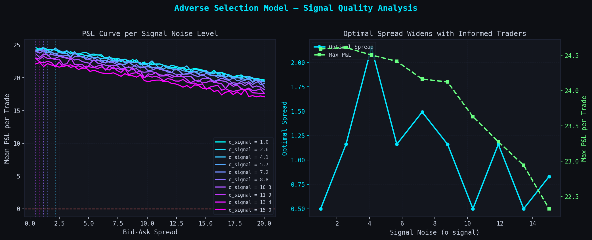
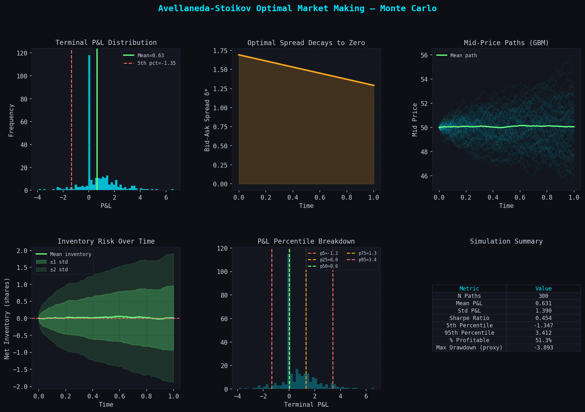
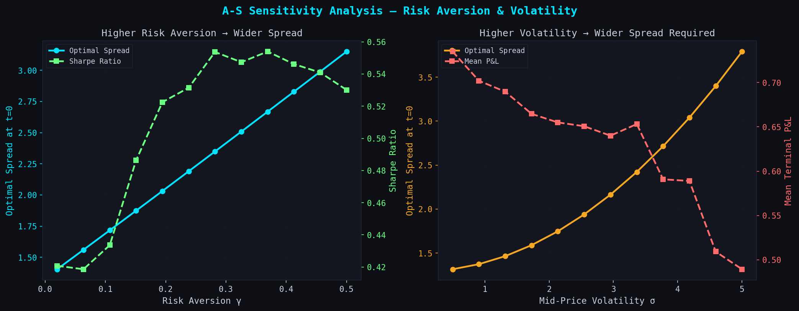

# Adverse Selection & Optimal Spread in Market Making

## Overview

This project models the core tension in market making: **tight spreads attract flow but lose money to informed traders**. It implements two complementary frameworks:

| Model | What it answers |
|---|---|
| **Adverse Selection** (baseline) | How sharp is the informed trader's signal? What spread protects the MM? |
| **Avellaneda-Stoikov (2008)** | Given inventory risk + volatility, what is the *mathematically optimal* spread? |

Both are run through **Monte Carlo simulation** (10,000–15,000 paths) with full visualisation of P&L distributions, inventory risk, spread decay, and sensitivity analysis.

---

## Results

### 1. Adverse Selection — P&L vs Spread across Signal Quality


**Key findings:**
- As trader signal quality improves (lower σ_signal), the MM must widen its spread to break even
- Tight spreads with sharp informed traders consistently produce negative expected P&L
- The optimal spread is not monotone in signal noise — there is a non-trivial trade-off between flow volume and adverse selection loss

### 2. Avellaneda-Stoikov Monte Carlo Dashboard


**Key findings:**
- Optimal spread decays deterministically to zero as T → 0 (end-of-session urgency)
- Inventory mean-reverts around zero under the reservation-price skew mechanism
- P&L distribution has positive skew: ~51% of paths profitable, Sharpe ≈ 0.45
- The ±2σ inventory band remains bounded, validating the risk-control property of A-S

### 3. Sensitivity Analysis — γ and σ


**Key findings:**
- Higher risk aversion (γ) → wider spread, but Sharpe peaks at an intermediate γ (~0.15–0.25)
- Higher volatility (σ) forces exponentially wider spreads, while mean P&L degrades
- There exists an optimal γ that maximises Sharpe — consistent with A-S theoretical predictions

---

## Models

### Baseline: Fixed Spread with Adverse Selection

```
Fair value:   V ~ Uniform[1, 100]
Trader signal: S = V + ε,  ε ~ N(0, σ²)
Trader trades: buys if S > ask, sells if S < bid
MM P&L:        (fair - ask) per buy hit, (bid - fair) per sell hit
```

**Insight:** The MM's break-even spread is determined entirely by how much information the trader has. This explains why real spreads widen around earnings announcements.

### Avellaneda-Stoikov (2008)

Closed-form optimal spread from expected-utility maximisation:

```
Reservation price:  r(s, q, t) = s − q·γ·σ²·(T − t)
Optimal spread:     δ* = γ·σ²·(T − t) + (2/γ)·ln(1 + γ/κ)
```

Where:
- `γ` = risk-aversion coefficient
- `σ` = mid-price volatility  
- `κ` = order arrival intensity
- `q` = current inventory (the skew term)

The reservation price skews quotes to reduce inventory: long inventory → lower bid and ask (encourages sells).

---

## Project Structure

```
market-making/
├── main.py                  # entry point — runs all simulations
├── requirements.txt
├── src/
│   ├── models.py            # BaselineModel + AvellanedaStoikov classes
│   ├── simulator.py         # Monte Carlo sweeps (signal quality, γ, σ)
│   └── visualizer.py        # all plots (dark terminal aesthetic)
└── results/
    ├── adverse_selection.png
    ├── avellaneda_stoikov.png
    └── sensitivity.png
```

---

## How to Run

```bash
git clone https://github.com/Qivoxe/Market-making.git
cd Market-making
pip install -r requirements.txt

python main.py          # full run (~30s)
python main.py --fast   # reduced paths for quick testing
```

---

## Concepts

| Concept | Where it appears |
|---|---|
| Adverse selection | Baseline model — informed trader erodes MM profits |
| Inventory risk | A-S model — position skew from one-sided flow |
| Reservation price | A-S — MM adjusts quotes based on current inventory |
| Stochastic control | Theoretical basis for A-S optimal spread derivation |
| Monte Carlo simulation | Empirical validation of both models across 10k+ paths |
| Market microstructure | Overall domain — why spreads exist, how they're set |

---

## References

- Avellaneda, M. & Stoikov, S. (2008). *High-frequency trading in a limit order book.* Quantitative Finance.
- Glosten, L. & Milgrom, P. (1985). *Bid, ask and transaction prices in a specialist market with heterogeneously informed traders.* Journal of Financial Economics.
